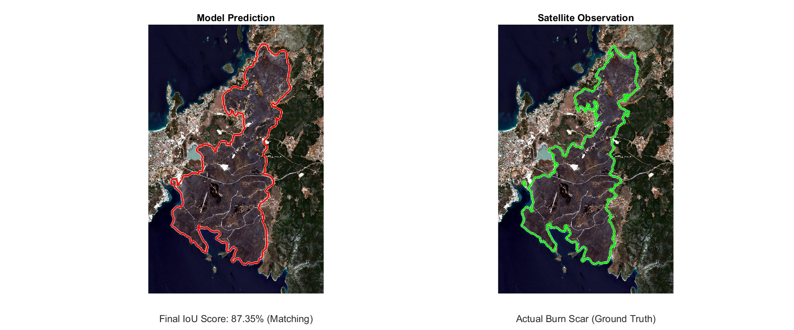
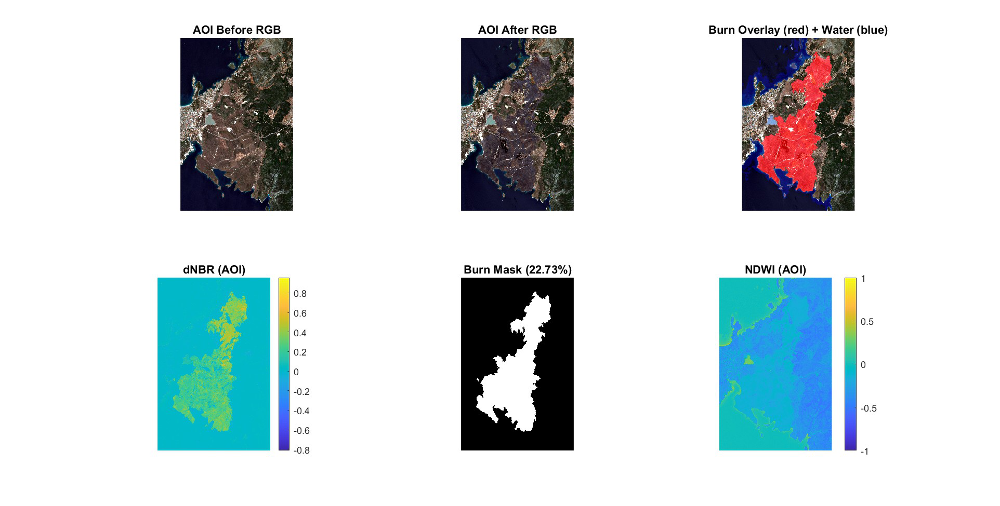
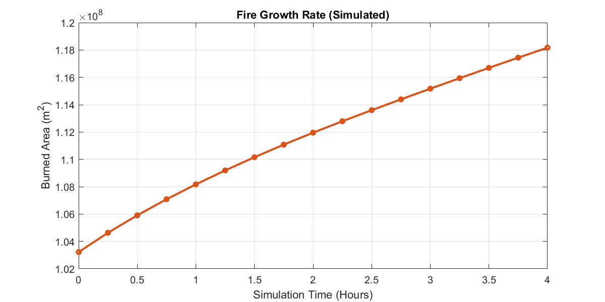
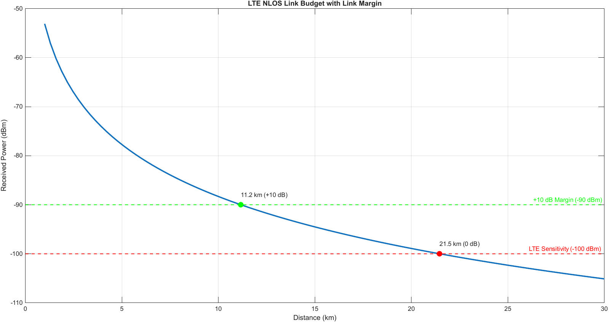
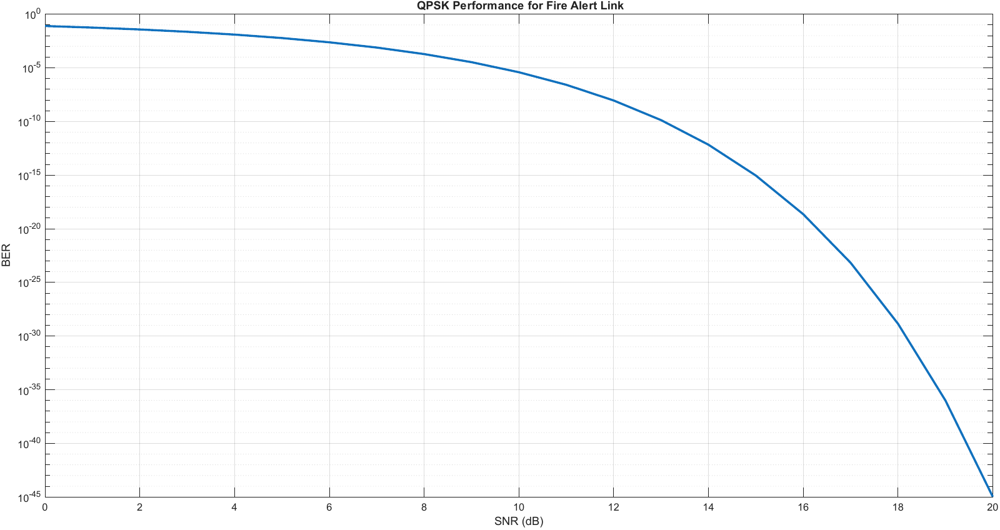
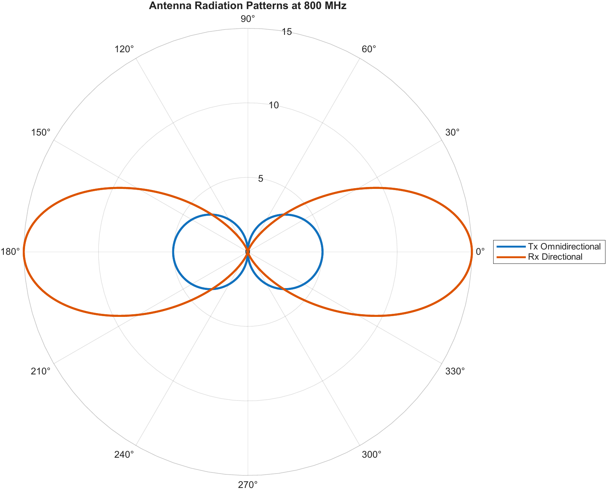
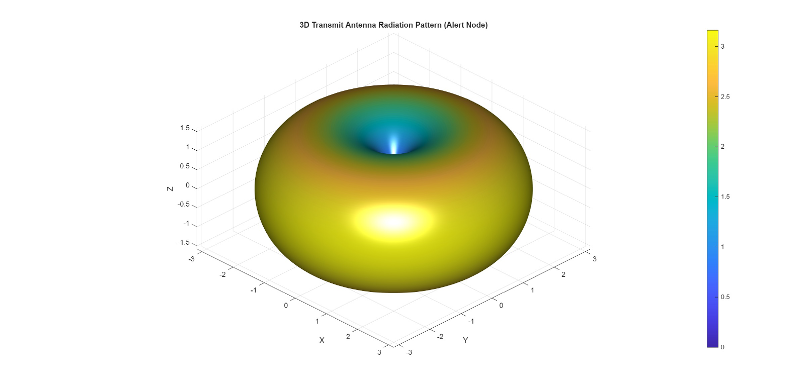
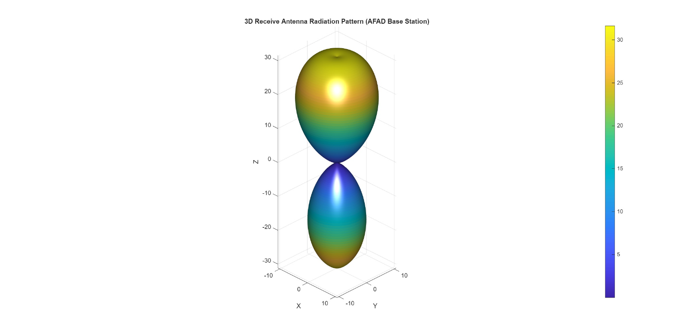
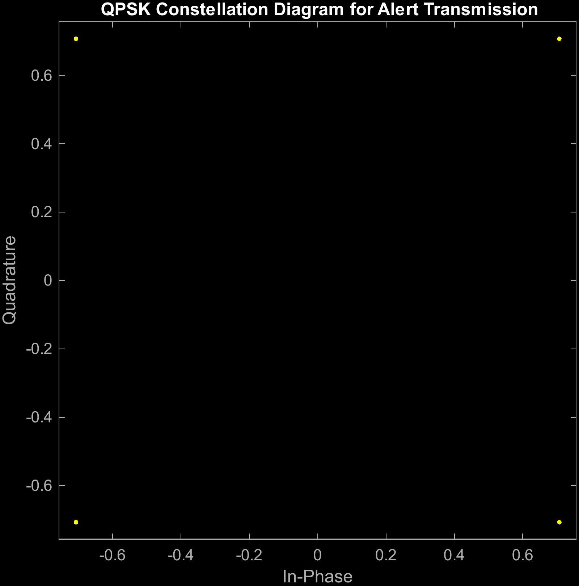

# Satellite-Based Wildfire Detection and Spread Prediction

*Team of 2 · course project · October 2025 – January 2026 · my part: communications layer (LTE alert link budget, QPSK) and part of the prediction model*

## Engineering question
Can freely available Copernicus data be turned into an end-to-end wildfire intelligence chain for the July 2025 Seferihisar (Aegean) fire? The chain covers detecting the burn scar, predicting its wind-driven spread, and reliably alerting the emergency authority (AFAD) over a non-line-of-sight link.

## Approach
1. **Detection and burn severity (Sentinel-2 MSI):**
   - Four snapshots: pre-fire 22 June, during-fire 2 and 5 July, post-fire 10 July 2025.
   - The area of interest (AOI) is cropped to 38.165–38.402° N, 26.362–26.560° E.
   - NBR/dNBR, NDVI and NDWI indices with an automatic (histogram-based) dNBR threshold, water masking and morphological cleaning.
2. **Atmospheric data (ERA5 reanalysis):** 10 m wind components (u, v), temperature and humidity.
   - Time-synchronised to the satellite overpass (2 July 2025, 09:04:11) over a 3-hour window.
   - Interpolated from the roughly 30 km ERA5 grid onto the 10 m satellite grid.
   - Wind speed = √(u² + v²) and spread direction = atan2(u, v).
3. **Fire spread prediction:** a 4-hour time-stepping model (Δt = 15 min) with a linear spread law D = (Rbase + Gwind·ws)·Δt.
   - Rbase = 0.008 m/s, Gwind = 0.005 m/s.
   - Elliptical, wind-aligned growth (ellipticity E = 2.5).
   - Validated against the observed burn scar using Intersection over Union (IoU).
4. **Alerting and communications (my part):**
   - **Decision gate:** an alert is sent only when detection confidence ≥ Cmin and burned area ≥ Amin.
   - **Link:** an LTE uplink at 800 MHz (Band 20) is chosen for non-line-of-sight propagation through vegetation and terrain.
   - **Link budget:** COST-231 Hata path-loss model.
   - **Modulation:** QPSK, with the BER over an AWGN channel, 2D and 3D Tx/Rx antenna radiation patterns, and the constellation diagram.

## Results
- **Detection:**
  - 2,642 × 1,719 px AOI; automatic dNBR threshold 0.15175.
  - **1,032,200 burned pixels (22.73 % of the land surface)**.
  - Mean dNBR in the burned area 0.260 (moderate severity).
- **Weather:** mean wind speed 4.28 m/s, maximum 7.12 m/s over the 3-hour window.
- **Spread prediction:**
  - **IoU of 87.35 %** against the Sentinel-2 burn scar.
  - The burned area grew from about 1.03 × 10⁸ m² to about 1.18 × 10⁸ m² in 4 h, a total growth of about 14.95 km².
- **Alert link:** a positive link margin of more than 10 dB up to about **11.2 km** (−90 dBm, i.e. 10 dB above the −100 dBm LTE sensitivity), with the link limit (0 dB margin) at about **21.5 km**. The simulated QPSK BER curve confirms reliable operation under the expected channel conditions.

## Validation
- **Prediction:** IoU between the simulated final fire perimeter and the Sentinel-2 ground-truth burn mask (87.35 %).
- **Detection:** NDVI change (dNDVI) cross-checks dNBR, and NDWI water masking avoids confusing water with burned land.
- **Link:** COST-231 Hata is a standard macro-cell planning model at UHF, and the QPSK BER is compared with the theoretical AWGN curve.

## Figures
Figures are taken from the report (figure numbers and captions as in the report).

*Figure 4: Multi-image analysis. Pre-fire RGB, post-fire overlay, dNBR heatmap and final binary burn mask after morphological cleaning and water subtraction.*

*Figure 5 (prediction vs satellite observation) is the header image.*

*Figure 6: Area growth in m².*

**Communications layer (my part)**

*Figure 8: Received power versus distance for the LTE NLOS alerting link using the COST-231 Hata model.*

*Figure 9: QPSK bit error rate performance versus SNR for the alerting link.*

*Figure 10: Two-dimensional radiation patterns of the transmit and receive antennas at 800 MHz.*

*Figure 11: Three-dimensional radiation patterns of (a) the alert-node transmit antenna and (b) the AFAD base-station receive antenna at 800 MHz.*

*Figure 12: QPSK constellation diagram for the wildfire alert transmission.*

## Code
Only code that is mine or that we wrote together is included here. The detection and tracking scripts written by my teammate are not part of this repository.

| Path | Content | Author | Opens with |
|---|---|---|---|
| `code/matlab/Reporting.m` | Alerting layer: COST-231 Hata link budget, link-margin distances, QPSK BER, antenna patterns (2D/3D), constellation, alert decision gate. Report appendix 10.4 prints the same code. | Kaoutar Ammara | MATLAB (Communications Toolbox for `berawgn`, `pskmod`, `scatterplot`) |
| `code/matlab/B_ERANetCDFwind_simplespreadprediction.m` | ERA5 NetCDF reading, time synchronisation and interpolation of wind, temperature and humidity onto the AOI grid (report appendix 10.2) | Joint | MATLAB |
| `code/matlab/C_Realistic_Final.m` | Wind-driven elliptical fire-spread model, IoU validation and area-growth plots (report appendix 10.3) | Joint | MATLAB (Image Processing Toolbox) |
| `code/matlab/Tracking_Predicting_Reporting.m`, `code/matlab/updateFire.m` | ERA5-driven spread prediction with an interactive time slider (`updateFire` is its slider callback) | Joint | MATLAB |
| `data/meteo/me.m` | Converts the ERA5 GRIB download to CSV | Joint | MATLAB (Mapping Toolbox for `readgeoraster`) |

### About the extracted code
`B_ERANetCDFwind_simplespreadprediction.m` and `C_Realistic_Final.m` were extracted from the report appendix (10.2 and 10.3), because they did not exist as code files. Only PDF copy artefacts were fixed:
- page numbers inside the listings removed (5 in 10.2, 3 in 10.3)
- curly quotes turned back into MATLAB straight quotes (31 in 10.2, 87 in 10.3)
- indentation restored from the printed layout

Three lines of 10.2 run off the right page margin in the PDF (the `fprintf("Using %d ERA5 steps …` message, the `fmts = {…}` date-format list and the `try … catch, end` line in `parseOriginDatetime`). They were completed from the original code.

The script still contains the original author's local path to the ERA5 file (`era5Nc = …`). Change it to point to `data/data_stream-oper_stepType-instant.nc` before running.

## Data
| Path | Content |
|---|---|
| `data/MODIS/fire_archive_J1V-C2_676101.csv`, `fire_nrt_J1V-C2_676101.csv` | NASA FIRMS VIIRS (J1V-C2) active-fire points (archive and near-real-time) |
| `data/MODIS/citation.txt` | Source note for the ITU-R digital maps |
| `data/data_stream-oper_stepType-instant.csv` | ERA5 hourly single-level data for 2 July 2025 over the AOI (u10, v10, d2m, t2m) |
| `data/data_stream-oper_stepType-instant.nc` | The same ERA5 data in NetCDF, read by the prediction scripts (`Tracking_Predicting_Reporting.m`, `B_…`) |
| `data/meteo/` | ERA5 download (`.zip`/`.grib`) and its CSV conversion |

**Not included (too large for GitHub, about 4.2 GB):**
- **Sentinel-2 L2A tiles** T35SMC for 22 June, 2 July, 5 July and 10 July 2025 (IDs in the report, Section 4.1). Download them free from the [Copernicus Data Space Ecosystem](https://dataspace.copernicus.eu/).
- **ITU-R digital maps** (`ITURDigitalMaps.tar.gz`, `p836.mat`, `p837.mat`, `p840.mat`, `maps.mat`). These are derived from ITU-R Recommendations P.836, P.837, P.840 and others, as listed in `data/MODIS/citation.txt`.

## How to reproduce
- **Alerting layer:** run `code/matlab/Reporting.m` in MATLAB. It is self-contained and regenerates Figures 8–12.
- **Spread prediction:**
  - The ERA5 NetCDF file is included in `data/`. `Tracking_Predicting_Reporting.m` opens it by file name only, so run it with `data/` as the current folder (or copy the file next to the script).
  - `B_…` and `C_…` also need `A_satellite_outputs.mat`, the output of the Sentinel-2 detection script (appendix 10.1, my teammate's part, not included here).
  - The processing steps and parameters are fully described in the report.

## Team and my contribution
Team of two: **Kaoutar Ammara** and **Yemeen Khalid**.
- **Kaoutar Ammara:** the communications and alerting layer (LTE alert link budget, QPSK, antenna patterns, alert decision gate), done entirely by me, and part of the fire-spread prediction model (wind direction and weather data integration).
- **Yemeen Khalid:** satellite detection and burn-severity processing, and fire tracking.

## References
Sentinel-2 User Handbook (ESA, 2023); ERA5 reanalysis (Copernicus Climate Change Service); COST-231 Hata model; NASA FIRMS. The full reference list is in the report.

---
Kaoutar Ammara · Aerospace Engineer · [GitHub](https://github.com/Kiwiiiieee) · [LinkedIn](https://linkedin.com/in/kaoutar-ammara)
